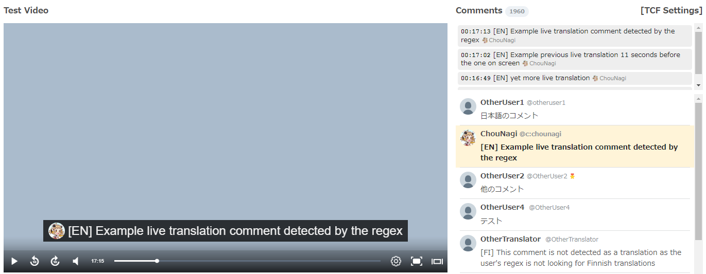
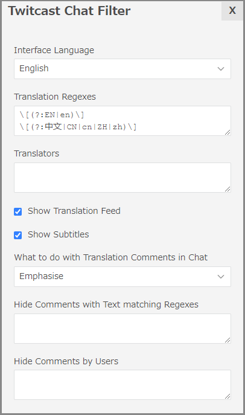

# Twitcast Chat Filter

## Overview

Twitcast Chat Filter is a userscript for the Twitcasting.tv site to improve user experience during livestreams.
It provides several features, many of them aimed at live translation support, and a settings panel to customise which ones you want enabled.

These include: Subtitles, Translation Comment Feed, Translation Comment Emphasis, and Chat Filtering.

## Features

### Settings Panel

The settings panel is accessed via a button above the chat feed.

### Language Support

TCF should autodetect your browser's preferred langauge, and render the settings panel in that language.
In the event your preferred language isn't supported or couldn't be detected, it will default to English.
You can change the language via a dropdown in the settings.
The interface presently supports 8 languages: Bahasa Indonesian, Chinese, Dutch, English, German, Portuguese, Japanese, Spanish

Note: There is no automatic translation of detected translation comments to other languages. The language only affects the interface.

### Translation Comments

Translation Comment detection is accomplished via regex checks of the message content, and direct comparison of twitcast usernames.
You can customise exactly what it's searching for.

Note: Since the square bracket characters which are often used to designate the language in live translations have special meaning in regexes, they must be escaped with a preceding backslash like so: `\[EN\]`

Note: Username searches go by the actual username of a user, not the display name, and will always start with the @ symbol
These are typically in the form `@c:USERNAME` for twitcast channels or `@USERNAME` for ones bound to twitter accounts.

By default, English `[EN]` and Chinese `[中文]` live translations will be detected by message content, since those are the most common live translation languages I've seen on twitcast. If you only speak one of those languages, I recommend removing the line to detect the language you don't speak to reduce clutter.

#### Subtitles

If enabled in the options, recently detected translations will show over the twitcast video as subtitles.
Timing for subtitles is automatically calculated based on the amount of text in the comment, and following subtitles occurs.
It's important to remember that due to the inherent delays involved in live translation, they will be delayed relative to the spoken lines.

#### Translation Feed

Since it can be hard to follow the translations if there's a lot of comments at once, there is the option to enable a separate comment feed just for translation comments. If enabled in the options, the most recent six translations will appear in a seperate comment feed above the regular live chat comment feed, also featuring the video timestamp of when they were seen.

#### Translation Comment Highlighting

If you wish to make translation comments more visible in the regular chat feed, you can select "Emphasise" from the dropdown in the options menu, which will display them in bold and with a yellow background, which will help them stand out.
If you prefer them to appear normally, you can select "Show Normally"
If you wish to hide the translation comments in the regular livestream chat feed (either because you speak the same language as the streamer, or because you're using the subtitles and/or translation feed to show them elsewhere), you can select "Hide"

### Chat Filtering

Sometimes there are comments you do not wish to see. Perhaps there's a particular inside joke or recurring gag among the fanbase that you're not a fan of, or maybe the comments of a certain watcher get on your nerves, or perhaps someone is deliberately posting mistranslations. You can make them disappear. For you at least. 

You can enter regexes (one per line) in the chat filter regex textarea to match content to be hidden.
Or you can enter usernames in the other textarea, and any comments by those users will be hidden, regardless of content.

Note: Translation comments are exempt from the message content regex filtering, but are affected by the username check.
This means translations may be about the streamer talking about topics you're uncomfortable with, but you won't see translations by users you blacklist. If you wish to exclude things from the translations that are detected, you'll need to edit the translation detection regex to include a negative lookahead.

For example, to exclude translations which contain the text `(DeepL)` case insensitive:

`\[(?:EN|en)\](?:(?!\([Dd][Ee][Ee][Pp][Ll]\)).)+$`

## Installation

This is a userscript. If you're not sure what that means, please look up what userscripts are, and what they are capable of before installing it. [Here is a brief guide to userscripts to get you started](https://simply-how.com/enhance-and-fine-tune-any-web-page-the-complete-user-scripts-guide)

If you have Greasemonkey, Tampermonkey or any similar userscript manager installed, you should be able to install it by simply visiting the installation url:

[https://github.com/ChouNagi/twitcast-chat-filter/raw/main/twitcast-chat-filter.user.js](https://github.com/ChouNagi/twitcast-chat-filter/raw/main/twitcast-chat-filter.user.js)

Once installed, simply refresh any open twitcast pages, and the new functionality is available.

## I found a bug

Please report your issue here, along with which version of the userscript you're using.
https://github.com/ChouNagi/twitcast-chat-filter/issues

If you're not running the latest version, I'd recommend updating to the latest version, as your issue might already be fixed.

## Change Log can be found here

https://github.com/ChouNagi/twitcast-chat-filter/blob/main/changelog.md